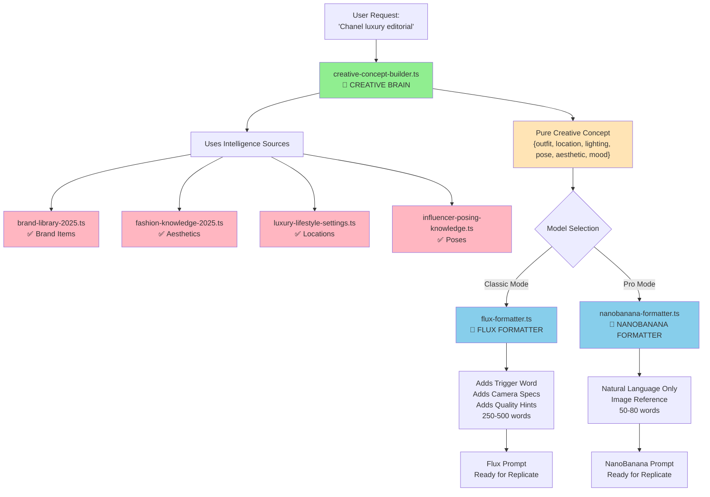

# Maya Prompt System - Creative/Technical Separation Design
*Generated: January 4, 2026*
*Status: DESIGN PROPOSAL - AWAITING APPROVAL*

---

## 🎯 DESIGN PHILOSOPHY

**Separate Maya's Creative Intelligence from Model-Specific Formatting**

Currently, prompt builders mix creative decisions (what outfit, what location) with technical formatting (trigger words, camera specs, word count). This creates:
- ❌ Duplicate creative logic across builders
- ❌ Hard to maintain brand intelligence
- ❌ Model-specific code mixed with creative code

**New Architecture:**
- ✅ **Creative Brain**: Pure concept generation (no model knowledge)
- ✅ **Smart Formatters**: Model-specific technical formatting
- ✅ **Single Source of Truth**: Brand intelligence lives in one place

---

## 📐 PHASE 1: MAYA'S CREATIVE BRAIN

### File: `lib/maya/creative-concept-builder.ts`

**Purpose**: Generate pure creative concepts without any model-specific syntax.

**Input:**
```typescript
interface CreativeConceptInput {
  userRequest: string              // "Chanel luxury editorial"
  category?: string | null          // "luxury-fashion" | null
  aesthetic?: string                // "quiet_luxury" | "mob_wife" | etc.
  userContext?: {
    age?: string
    gender?: string
    ethnicity?: string
    physicalPreferences?: string
    hairStyle?: string
  }
  brandPreferences?: {
    preferredBrands?: string[]      // ["Chanel", "Bottega"]
    avoidBrands?: string[]          // ["Nike"]
  }
  conversationContext?: string       // Previous messages for context
}
```

**Output:**
```typescript
interface CreativeConcept {
  outfit: {
    brand: string                   // "Chanel"
    items: Array<{
      type: string                  // "jacket" | "bag" | "shoes"
      brand: string                 // "Chanel"
      name: string                  // "black tweed jacket with gold chain trim"
      colors: string[]              // ["black", "gold"]
      details?: string[]            // ["quilted", "classic"]
    }>
    colors: string[]                // ["black", "beige", "gold"]
    style: string                   // "quiet luxury"
    description: string             // Full outfit description
  }
  location: {
    setting: string                 // "Parisian apartment"
    details: string[]               // ["cream walls", "marble fireplace", "vintage furniture"]
    environment: string             // "indoor" | "outdoor" | "studio"
    backdrop: string                // "minimalist luxury interior"
  }
  lighting: {
    type: string                    // "natural window light"
    quality: string                 // "soft diffused"
    direction: string               // "from left side"
    timeOfDay?: string              // "golden hour" | "midday"
    mood: string                    // "elegant" | "dramatic"
  }
  pose: {
    description: string             // "standing elegantly by window"
    energy: string                  // "calm" | "dynamic" | "confident"
    bodyLanguage: string             // "one hand on hip, looking away"
    expression: string               // "serene" | "confident" | "peaceful"
  }
  aesthetic: {
    vibe: string                    // "quiet luxury"
    keywords: string[]              // ["The Row aesthetic", "old money style"]
    instagramStyle: string          // "editorial" | "lifestyle" | "street"
    reference: string                // "reminiscent of The Row campaigns"
  }
  mood: {
    overall: string                 // "sophisticated elegance"
    feeling: string                 // "effortless wealth"
    atmosphere: string               // "understated luxury"
  }
  metadata: {
    category: string                // "luxury-fashion"
    season?: string                  // "winter" | "summer"
    occasion?: string                // "editorial" | "casual"
  }
}
```

**Key Functions:**
```typescript
/**
 * Generate a pure creative concept from user request
 * Uses brand-library-2025.ts and fashion-knowledge-2025.ts
 * NO model-specific syntax (no trigger words, no camera specs, no word count)
 */
export function generateCreativeConcept(
  input: CreativeConceptInput
): CreativeConcept

/**
 * Generate outfit using brand library
 */
function generateOutfit(
  category: string | null,
  aesthetic: string | undefined,
  brandPreferences?: BrandPreferences
): OutfitConcept

/**
 * Select aesthetic from fashion knowledge
 */
function selectAesthetic(
  userRequest: string,
  category: string | null
): AestheticSelection

/**
 * Generate location based on category and aesthetic
 */
function generateLocation(
  category: string | null,
  aesthetic: AestheticSelection
): LocationConcept

/**
 * Generate lighting based on aesthetic and location
 */
function generateLighting(
  aesthetic: AestheticSelection,
  location: LocationConcept
): LightingConcept

/**
 * Generate pose based on category and mood
 */
function generatePose(
  category: string | null,
  mood: string
): PoseConcept
```

**Intelligence Sources:**
- ✅ `brand-library-2025.ts` - For outfit generation
- ✅ `fashion-knowledge-2025.ts` - For aesthetic selection
- ✅ `luxury-lifestyle-settings.ts` - For location intelligence
- ✅ `lifestyle-contexts.ts` - For lifestyle context
- ✅ `influencer-posing-knowledge.ts` - For pose intelligence
- ✅ `instagram-location-intelligence.ts` - For location details

**NO Model Knowledge:**
- ❌ No trigger words
- ❌ No camera specs
- ❌ No word count limits
- ❌ No Flux-specific syntax
- ❌ No NanoBanana-specific syntax

---

## 🔧 PHASE 2: SMART FORMATTERS

### File: `lib/maya/formatters/flux-formatter.ts`

**Purpose**: Format creative concept into Flux-specific technical prompt.

**Input:**
```typescript
interface FluxFormatterInput {
  concept: CreativeConcept           // From creative-concept-builder.ts
  userModel: {
    triggerWord: string              // "person" | custom trigger
    loraScale?: number               // 0.7 - 1.0
  }
  userContext: {
    gender: string
    ethnicity?: string
    physicalPreferences?: string
  }
  options?: {
    includeQualityHints?: boolean    // Default: true
    includeHandGuidance?: boolean    // Default: true
    wordCount?: { min: number, max: number }  // Default: 250-500
  }
}
```

**Output:**
```typescript
interface FluxFormattedPrompt {
  prompt: string                     // 250-500 word detailed prompt
  components: {
    trigger: string                  // "person" (with trigger word)
    gender: string                   // "woman" | "man"
    outfit: string                   // Full outfit description
    location: string                 // Full location description
    lighting: string                 // Full lighting description
    pose: string                     // Full pose description
    aesthetic: string                // Aesthetic keywords
    quality: string[]                // Quality hints
    camera: string                   // Camera specs
    resolution: string               // "4K resolution, Hyper-realistic"
  }
  wordCount: number
  characterCount: number
}
```

**Key Functions:**
```typescript
/**
 * Format creative concept for Flux model
 * Adds trigger word, camera specs, quality hints, technical details
 */
export function formatForFlux(
  input: FluxFormatterInput
): FluxFormattedPrompt

/**
 * Add trigger word to prompt
 */
function addTriggerWord(
  prompt: string,
  triggerWord: string
): string

/**
 * Add camera specs based on category
 */
function addCameraSpecs(
  concept: CreativeConcept
): string

/**
 * Add quality hints (Flux-specific)
 */
function addQualityHints(
  concept: CreativeConcept
): string[]

/**
 * Add aesthetic keywords from fashion knowledge
 */
function addAestheticKeywords(
  concept: CreativeConcept
): string

/**
 * Build full prompt with all components
 */
function buildFluxPrompt(
  concept: CreativeConcept,
  components: FluxComponents
): string
```

**Technical Additions:**
- ✅ Trigger word insertion
- ✅ Camera specs (from category mapping)
- ✅ Quality hints ("4K resolution", "Hyper-realistic")
- ✅ Hand guidance ("perfect hands with five fingers")
- ✅ Word count: 250-500 words
- ✅ Aesthetic keywords from fashion-knowledge-2025.ts

---

### File: `lib/maya/formatters/nanobanana-formatter.ts`

**Purpose**: Format creative concept into NanoBanana Pro natural language prompt.

**Input:**
```typescript
interface NanoBananaFormatterInput {
  concept: CreativeConcept           // From creative-concept-builder.ts
  userContext?: {
    hasReferenceImages: boolean      // True if user uploaded images
    imageCount?: number              // Number of reference images
  }
  options?: {
    wordCount?: { min: number, max: number }  // Default: 50-80
    includeImageReference?: boolean  // Default: true if hasReferenceImages
  }
}
```

**Output:**
```typescript
interface NanoBananaFormattedPrompt {
  prompt: string                     // 50-80 word natural language prompt
  components: {
    imageReference?: string          // "Woman, maintaining exactly the characteristics..."
    outfit: string                   // Simplified outfit description
    location: string                 // Simplified location
    lighting: string                 // Simplified lighting
    pose: string                     // Simplified pose
    mood?: string                     // Optional mood
  }
  wordCount: number
  characterCount: number
}
```

**Key Functions:**
```typescript
/**
 * Format creative concept for NanoBanana Pro
 * Natural language, no trigger words, no technical specs
 */
export function formatForNanoBanana(
  input: NanoBananaFormatterInput
): NanoBananaFormattedPrompt

/**
 * Simplify outfit description for natural language
 */
function simplifyOutfit(
  outfit: OutfitConcept
): string

/**
 * Simplify location description
 */
function simplifyLocation(
  location: LocationConcept
): string

/**
 * Simplify lighting description
 */
function simplifyLighting(
  lighting: LightingConcept
): string

/**
 * Add image reference if user has uploaded images
 */
function addImageReference(
  hasImages: boolean,
  imageCount?: number
): string | undefined

/**
 * Build natural language prompt
 */
function buildNanoBananaPrompt(
  concept: CreativeConcept,
  components: NanoBananaComponents
): string
```

**Technical Simplifications:**
- ❌ NO trigger words
- ❌ NO camera specs
- ❌ NO technical quality hints
- ❌ NO "4K resolution" or "Hyper-realistic"
- ✅ Natural language only
- ✅ 50-80 words
- ✅ Image reference if user uploaded images

---

## 📊 PHASE 3: BEFORE/AFTER EXAMPLES

### Example: "Chanel luxury editorial"

#### 1. MAYA'S CREATIVE OUTPUT (Pure Concept)

```json
{
  "outfit": {
    "brand": "Chanel",
    "items": [
      {
        "type": "jacket",
        "brand": "Chanel",
        "name": "black tweed jacket with gold chain trim",
        "colors": ["black", "gold"],
        "details": ["classic", "quilted", "iconic"]
      },
      {
        "type": "bag",
        "brand": "Chanel",
        "name": "Classic Flap bag",
        "colors": ["black"],
        "details": ["quilted", "gold chain strap"]
      }
    ],
    "colors": ["black", "beige", "gold"],
    "style": "quiet luxury",
    "description": "Chanel black tweed jacket with gold chain trim, paired with Classic Flap bag"
  },
  "location": {
    "setting": "Parisian apartment",
    "details": ["cream walls", "marble fireplace", "vintage furniture", "floor-to-ceiling windows"],
    "environment": "indoor",
    "backdrop": "minimalist luxury interior"
  },
  "lighting": {
    "type": "natural window light",
    "quality": "soft diffused",
    "direction": "from left side",
    "timeOfDay": "golden hour",
    "mood": "elegant"
  },
  "pose": {
    "description": "standing elegantly by window",
    "energy": "calm",
    "bodyLanguage": "one hand on hip, looking away",
    "expression": "serene"
  },
  "aesthetic": {
    "vibe": "quiet luxury",
    "keywords": ["The Row aesthetic", "old money style", "understated elegance"],
    "instagramStyle": "editorial",
    "reference": "reminiscent of The Row campaigns"
  },
  "mood": {
    "overall": "sophisticated elegance",
    "feeling": "effortless wealth",
    "atmosphere": "understated luxury"
  },
  "metadata": {
    "category": "luxury-fashion",
    "season": "winter",
    "occasion": "editorial"
  }
}
```

#### 2. FLUX FORMATTED VERSION (Technical)

```
person, woman, wearing Chanel black tweed jacket with gold chain trim, paired with Classic Flap bag in black with quilted design and gold chain strap, standing elegantly by window in Parisian apartment with cream walls, marble fireplace, vintage furniture, and floor-to-ceiling windows, soft diffused natural window light from left side during golden hour creating elegant mood, one hand on hip, looking away with serene expression, quiet luxury aesthetic reminiscent of The Row campaigns, old money style, understated elegance, editorial style, Hasselblad X2D 100C 55mm f/2.5 lens, 4K resolution, Hyper-realistic, perfect hands with five fingers, well-formed hands, anatomically correct hands, professional photography, high quality, detailed
```

**Word Count**: 127 words  
**Components Added**:
- ✅ Trigger word: "person"
- ✅ Camera specs: "Hasselblad X2D 100C 55mm f/2.5 lens"
- ✅ Quality hints: "4K resolution, Hyper-realistic"
- ✅ Hand guidance: "perfect hands with five fingers..."
- ✅ Aesthetic keywords: "quiet luxury aesthetic", "The Row campaigns"

#### 3. NANOBANANA FORMATTED VERSION (Simple)

```
Woman, maintaining exactly the characteristics of the woman in images 1-3 (face, body, skin tone, hair and visual identity), without copying the photo. Wearing Chanel black tweed jacket with gold chain trim and Classic Flap bag. Standing elegantly by window in Parisian apartment with soft diffused natural light. Serene expression, calm energy, sophisticated elegance.
```

**Word Count**: 58 words  
**Components**:
- ✅ Image reference: "Woman, maintaining exactly the characteristics..."
- ❌ NO trigger word
- ❌ NO camera specs
- ❌ NO quality hints
- ✅ Natural language only
- ✅ Simplified descriptions

---

## 🔄 ARCHITECTURE FLOW DIAGRAM



---

## 📁 FILE STRUCTURE

```
lib/maya/
├── creative-concept-builder.ts          # NEW: Creative brain (no model knowledge)
├── formatters/                          # NEW: Model-specific formatters
│   ├── flux-formatter.ts               # NEW: Flux formatting
│   ├── nanobanana-formatter.ts         # NEW: NanoBanana formatting
│   └── index.ts                        # NEW: Exports
├── brand-library-2025.ts               # KEEP: Core intelligence
├── fashion-knowledge-2025.ts           # KEEP: Aesthetic intelligence
├── luxury-lifestyle-settings.ts         # KEEP: Location intelligence
├── lifestyle-contexts.ts                # KEEP: Lifestyle intelligence
├── influencer-posing-knowledge.ts       # KEEP: Pose intelligence
├── instagram-location-intelligence.ts   # KEEP: Location details
├── prompt-constructor.ts                # DEPRECATE: Replace with creative-concept-builder + flux-formatter
├── prompt-constructor-enhanced.ts       # DEPRECATE: Replace with creative-concept-builder + nanobanana-formatter
└── nano-banana-prompt-builder.ts       # DEPRECATE: Replace with creative-concept-builder + nanobanana-formatter
```

---

## 🔄 MIGRATION PATH

### Step 1: Create New Files (No Breaking Changes)
- ✅ Create `lib/maya/creative-concept-builder.ts`
- ✅ Create `lib/maya/formatters/flux-formatter.ts`
- ✅ Create `lib/maya/formatters/nanobanana-formatter.ts`
- ✅ Keep old builders working

### Step 2: Parallel Testing
- ✅ Add new system alongside old system
- ✅ Test with same inputs
- ✅ Compare outputs
- ✅ Verify quality matches or improves

### Step 3: Gradual Migration
- ✅ Migrate `/api/maya/generate-concepts` first
- ✅ Migrate `/api/maya/generate-image` second
- ✅ Migrate Studio Pro routes third
- ✅ Migrate Feed Planner routes last

### Step 4: Cleanup
- ✅ Remove old builders after migration complete
- ✅ Archive deprecated files
- ✅ Update documentation

---

## ✅ BENEFITS

### 1. Single Source of Truth
- ✅ Brand intelligence lives in `brand-library-2025.ts` only
- ✅ Fashion knowledge lives in `fashion-knowledge-2025.ts` only
- ✅ Creative decisions made once, formatted many ways

### 2. Easier Maintenance
- ✅ Update brand library → all formatters benefit
- ✅ Update fashion knowledge → all formatters benefit
- ✅ No duplicate creative logic

### 3. Model Flexibility
- ✅ Add new model? Just create new formatter
- ✅ Creative brain stays the same
- ✅ No need to duplicate brand/fashion intelligence

### 4. Better Testing
- ✅ Test creative concept generation separately
- ✅ Test formatters separately
- ✅ Easier to debug issues

### 5. Clear Separation
- ✅ Creative team thinks about concepts
- ✅ Technical team thinks about formatting
- ✅ Clear boundaries

---

## ⚠️ RISKS & MITIGATION

### Risk 1: Output Quality Changes
**Mitigation**: 
- Parallel testing before migration
- A/B test with real users
- Rollback plan ready

### Risk 2: Performance Impact
**Mitigation**:
- Creative concept generation should be fast (just data lookups)
- Formatters are simple string builders
- No AI calls in formatters

### Risk 3: Missing Edge Cases
**Mitigation**:
- Comprehensive test suite
- Test all current production routes
- Test all categories and aesthetics

### Risk 4: Breaking Changes
**Mitigation**:
- Gradual migration (one route at a time)
- Keep old builders until migration complete
- Feature flag for new system

---

## 📋 IMPLEMENTATION CHECKLIST

### Phase 1: Creative Brain
- [ ] Create `creative-concept-builder.ts`
- [ ] Implement `generateCreativeConcept()`
- [ ] Implement `generateOutfit()` using brand-library
- [ ] Implement `selectAesthetic()` using fashion-knowledge
- [ ] Implement `generateLocation()` using location intelligence
- [ ] Implement `generateLighting()` using aesthetic
- [ ] Implement `generatePose()` using pose knowledge
- [ ] Unit tests for creative concept generation

### Phase 2: Flux Formatter
- [ ] Create `formatters/flux-formatter.ts`
- [ ] Implement `formatForFlux()`
- [ ] Implement trigger word insertion
- [ ] Implement camera specs mapping
- [ ] Implement quality hints
- [ ] Implement hand guidance
- [ ] Unit tests for Flux formatting

### Phase 3: NanoBanana Formatter
- [ ] Create `formatters/nanobanana-formatter.ts`
- [ ] Implement `formatForNanoBanana()`
- [ ] Implement natural language simplification
- [ ] Implement image reference handling
- [ ] Unit tests for NanoBanana formatting

### Phase 4: Integration
- [ ] Update `/api/maya/generate-concepts` to use new system
- [ ] Update `/api/maya/generate-image` to use new system
- [ ] Update Studio Pro routes to use new system
- [ ] Update Feed Planner routes to use new system
- [ ] Integration tests

### Phase 5: Cleanup
- [ ] Archive old builders
- [ ] Update documentation
- [ ] Remove deprecated code

---

## 🎯 SUCCESS CRITERIA

1. ✅ Creative concepts generated correctly (all fields populated)
2. ✅ Flux formatter produces 250-500 word prompts with trigger words
3. ✅ NanoBanana formatter produces 50-80 word natural language prompts
4. ✅ No quality degradation vs current system
5. ✅ All production routes migrated successfully
6. ✅ Old builders removed
7. ✅ Documentation updated

---

## 📝 NEXT STEPS

1. **Review this design proposal**
2. **Approve architecture** (or request changes)
3. **Start Phase 1** (Creative Brain implementation)
4. **Test with examples** (verify output quality)
5. **Proceed with Phase 2** (Formatters)

---

*End of Design Proposal*

