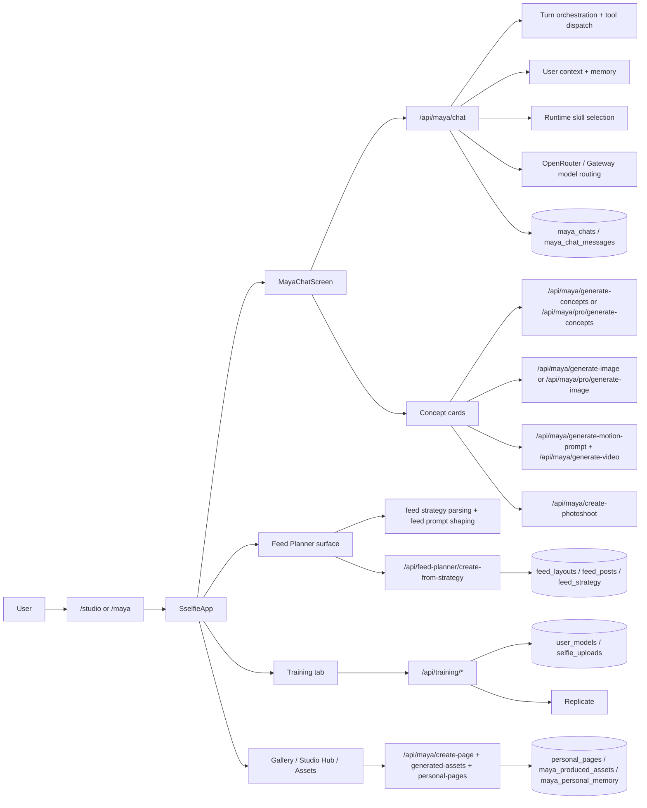

# Maya System Map

Status: live-code audit as of 2026-03-09
Scope: user-facing Maya only. Admin-only surfaces are called out but excluded from the main map.

Current product lock (2026-03-11):

- Recovery plan source of truth: `docs/MAYA_RELIABILITY_PROGRAM_2026-03-11.md`
- Visible Maya top tabs are `Chat`, `Videos`, and `Train`
- `Prompts` and `Feed` still exist in code, but are not part of the locked visible Maya surface
- `/api/maya/create-page` and `/api/maya/create-pdf` are retired with `410` responses

## 1. What Maya is in this repo

Maya is not just a chat assistant. In the live codebase, Maya is the main user operating layer for:

- conversational guidance
- concept generation
- Classic photo generation with a trained FLUX LoRA model
- Studio Pro photo generation with Nano Banana Pro on Replicate
- video motion prompting and video generation
- feed strategy, feed prompts, and feed creation
- model training state and training entry points
- asset drafting for landing pages, calendars, and workbooks
- gallery/history/memory persistence

The closest live description is: Maya is the app shell plus the orchestration layer behind most creation workflows.

## 2. Scope and exclusions

Included:

- `/maya` and `/studio` Maya surfaces
- Maya chat and tool dispatch
- concept cards
- prompt pipelines
- Replicate integrations
- feed planner and feed generation
- video pipeline
- training pipeline
- Maya memory and user context
- Maya-generated assets and HTML pages
- database/auth/data flow
- runtime Maya skills and knowledge libraries

Excluded from main flow:

- admin dashboards
- admin prompt builder
- admin-only Pro Photoshoot workflow

Important exclusion note:

- The codebase contains a Pro Photoshoot system under `app/api/maya/pro/photoshoot/*`, but those routes are admin-gated with `requireAdmin()` and `isProPhotoshootEnabled()`. They are Maya-related, but not part of the normal user-facing Maya surface.

## 3. Top-level architecture

## 4. Frontend surface map

### Entry pages

- `app/studio/page.tsx`
  - main entry for most users
  - resolves Supabase user -> Neon user
  - grants free-user welcome credits
  - mounts `SselfieApp`
- `app/maya/page.tsx`
  - direct Maya entry
  - blocks paid-blueprint-only users from Maya and redirects them to `/blueprint`
  - mounts `SselfieApp`

### Main shell

- `components/sselfie/sselfie-app.tsx`
  - the main app shell
  - owns top-level tabs and onboarding gating
  - fetches credits, onboarding, training, and product state
  - tabs include `maya`, `studio`, `gallery`, `feed-planner`, `academy`, `account`

### Maya UI

- `components/sselfie/maya-chat-screen.tsx`
  - the live Maya orchestration surface
  - owns chat state, mode state, image library state, concept trigger detection, and tool marker rendering
  - loads/saves messages via Maya APIs
  - internally tracks tabs for `photos`, `videos`, `prompts`, `training`, `feed`
  - important current-state note: only `photos`, `videos`, and `training` are part of the locked visible Maya surface

- `components/sselfie/maya/maya-tab-switcher.tsx`
  - live visible tabs are `Chat`, `Videos`, `Train`
  - product direction is to treat `Chat` as the `Photos` surface

- `components/sselfie/maya/maya-chat-interface.tsx`
  - renders assistant/user messages, tool parts, concept cards, feed cards, video cards

- `components/sselfie/concept-card.tsx`
  - the core execution unit for Maya concepts
  - supports:
    - Classic image generation
    - Studio Pro image generation
    - video generation
    - classic photoshoot creation
    - prompt editing
    - gallery loading for Pro mode
    - persistence of generated image/video/carousel state back into chat JSONB

### Other Maya tabs

- `components/sselfie/maya/maya-prompts-tab.tsx`
  - prompt library / prompt execution surface
  - loads prompts, favorites, generated images, and gallery lookups

- `components/sselfie/maya/maya-videos-tab.tsx`
  - video surface
  - loads candidate source images
  - generates motion prompts and videos
  - polls `generated_videos`

- `components/sselfie/maya/maya-training-tab.tsx`
  - training state surface
  - reads `/api/training/status` and `/api/training/progress`
  - routes user into training/onboarding flow

- `components/sselfie/maya/maya-feed-tab.tsx`
  - feed-chat UI logic still exists
  - parses `[CREATE_FEED_STRATEGY]` triggers
  - stores feed cards inside Maya chat messages
  - not currently exposed as a live visible Maya tab

### Standalone Feed Planner surface

- `app/feed-planner/feed-planner-client.tsx`
  - separate, full feed-planner experience
  - has its own onboarding/wizard/access-control logic
  - renders `FeedViewScreen`
  - this is where most active feed-planner UX lives now, not in the disabled Maya feed tab

## 5. Auth and user resolution

Maya uses a two-layer user model:

- authentication: Supabase auth
- app data: Neon Postgres user row

Key files:

- `lib/auth-helper.ts`
  - cached Supabase auth resolution
- `lib/auth/with-auth.ts`
  - shared API auth wrapper
- `lib/user-mapping.ts`
  - maps Supabase auth user to Neon `users` row
  - creates a Neon user if needed
- `lib/simple-impersonation.ts`
  - admin impersonation helper used across APIs

Live pattern:

1. `getAuthenticatedUser()` resolves Supabase user
2. `getEffectiveNeonUser()` or `getUserByAuthId()` resolves app user
3. Maya APIs use the Neon user id for data tables, credits, training, and generation

## 6. Main chat pipeline

Primary live route:

- `app/api/maya/chat/route.ts`

This is the real Maya backend for both Classic and Pro chat. The frontend does not primarily talk to `app/api/maya/pro/chat/route.ts`; it talks to `/api/maya/chat` and switches behavior with headers like:

- `x-studio-pro-mode`
- `x-chat-type`
- `x-active-tab`

### Chat flow

1. `useMayaChat` sends UI messages to `/api/maya/chat`
2. the route authenticates the user and resolves chat type/mode
3. it loads Maya user context with `getUserContextForMaya()`
4. it builds a system prompt with Maya persona + user context + runtime skill addendum
5. it runs orchestration before the LLM reply:
   - memory intent
   - tool dispatch intent
   - asset create/edit intent
   - offer brief collection
6. if no direct tool/asset action is triggered, it streams the text response from the routed LLM
7. chat session state and messages are persisted through the Maya chat/save-message/update-message flows into `maya_chats` and `maya_chat_messages`
8. assistant tool markers are rendered back into inline UI blocks on the client

### Tool dispatch layer

Key files:

- `lib/maya/tool-orchestrator.ts`
- `lib/maya/intent-dispatcher.ts`
- `lib/maya/tool-registry.ts`

Runtime tool markers currently cover:

- `show_capabilities`
- `show_studio_hub`
- `show_gallery`
- `save_to_gallery`
- `generate_image`
- `generate_video`
- `show_upload_zone`
- `create_asset`
- `edit_asset`
- `collect_offer_brief`
- `structured_asset_blocked`

### Chat model routing

Key file:

- `lib/maya/openrouter.ts`

Current task routing:

- `chat_default` -> `anthropic/claude-haiku-4.5`
- `chat_pro` -> `anthropic/claude-sonnet-4.5`
- `prompt_builder` -> `anthropic/claude-sonnet-4.5`
- `feed_planner` -> `anthropic/claude-sonnet-4.5`
- `pro_photoshoot` -> `anthropic/claude-sonnet-4.5`
- `feed_prompt*` -> `anthropic/claude-sonnet-4.5`

### Chat credits

Key file:

- `lib/maya/chat-credit-policy.ts`

Current rule:

- Classic Maya chat can deduct chat credits
- Studio Pro chat does not deduct chat credits
- admin/prompt-builder chats do not deduct chat credits

## 7. How Maya knows each user

Primary context assembler:

- `lib/maya/get-user-context.ts`

This builds the live user context string injected into Maya prompts and chat.

### Data sources Maya uses

- `users`
  - gender
  - ethnicity
- `user_personal_brand`
  - business type
  - visual aesthetic
  - settings preference
  - fashion style
  - communication voice
  - signature phrases
  - audience, pain points, transformation
  - brand voice, themes, pillars, vibe
  - color palette
  - physical appearance preferences
- `brand_assets`
  - uploaded reference/brand files
- `maya_personal_memory`
  - `memory_data`
  - remembered preference notes
  - latest offer brief
  - active asset context
  - agent context note
- `maya_concepts`
  - recent creative session history
- `academy_course_purchases`
  - product ownership
- subscription check
  - whether the user has Studio membership

### Memory-specific behavior

Key files:

- `lib/maya/memory-layer.ts`
- `lib/maya/memory-store.ts`
- `lib/maya/user-snapshot.ts`

Maya currently remembers:

- explicit “remember this” notes
- style feedback notes
- latest offer brief
- active asset editing workspace
- generated assets in memory
- lightweight interaction stats

Important implementation note:

- repo docs mention `agent_profiles` as part of the target architecture
- the live Maya implementation mostly relies on `user_personal_brand` plus `maya_personal_memory.memory_data`
- `agent_profiles` is not the active center of the current user-context pipeline

## 8. Runtime Maya skills

There are two different meanings of “skills” in this repo.

### A. Runtime Maya prompt skills

These are injected into the live chat/prompt pipeline.

Files:

- `lib/maya/skills/skill-router.ts`
- `lib/maya/skills/nano-banana-pro-skill.ts`
- `lib/maya/skills/motion-prompting-skill.ts`

Current runtime skill selection:

- `image_high_fidelity`
  - source: `nano_banana_pro`
  - used for Pro / high-fidelity image intent
- `video_motion`
  - source: `motion_prompting`
  - used for motion/video intent
- `fallback_image`
  - baseline prompt discipline

### B. Repo-level Maya operating skill

This is documentation/instructions for agents working on Maya, not the app runtime:

- `skills/sselfie-maya-os/SKILL.md`

It points to:

- `skills/sselfie-maya-os/references/user-journey.md`
- `skills/sselfie-maya-os/references/screen-map.md`

## 9. Prompt pipeline map

### 9.1 Canonical prompt authority

Canonical import path:

- `lib/generation/prompt/index.ts`

Important reality:

- the “canonical” layer mostly re-exports from `lib/generation/prompt/legacy-authority.ts`
- so the authority layer exists, but much of the actual implementation is still the extracted legacy authority wrapper

Key exports:

- Classic:
  - `generatePrompt`
  - `generateConceptCardsViaAuthority`
  - `generateMayaFeedPromptSystemPrompt`
  - `generateFeedPlannerStrategyPromptViaAuthority`
  - `generateFeedPlannerClassicModePromptViaAuthority`
- Pro:
  - `generateStudioProPromptsViaAuthority`
  - `generateFeedPlannerProModePromptViaAuthority`
  - `routeProModeImagePromptViaAuthority`
- Video:
  - `buildVideoAuthorityPrompt`

### 9.2 Classic concept pipeline

Primary files:

- `app/api/maya/generate-concepts/route.ts`
- `lib/maya/prompt-constructor.ts`
- `lib/generation/prompt/legacy-authority.ts`

Flow:

1. Maya chat emits `[GENERATE_CONCEPTS]`
2. `maya-chat-screen.tsx` detects the marker
3. client calls `/api/maya/generate-concepts`
4. route gathers:
   - user context
   - Flux prompting principles
   - fashion knowledge
   - lifestyle contexts
   - Instagram location intelligence
   - optional guide/reference-image context
5. prompt generation routes through authority helpers and/or `prompt-constructor.ts`
6. the response becomes concept cards in chat

Classic prompt characteristics:

- trigger-word based
- FLUX LoRA oriented
- structured
- technical camera/lighting language
- uses real brand/style references from brand libraries

### 9.3 Classic image generation

Primary files:

- `app/api/maya/generate-image/route.ts`
- `lib/replicate-client.ts`
- `lib/replicate-helpers.ts`

Flow:

1. concept card calls `/api/maya/generate-image`
2. route requires a completed trained model from `user_models`
3. prompt is normalized with:
   - `ensureTriggerWordPrefix`
   - `ensureGenderInPrompt`
4. Replicate prediction is created with the user’s `replicate_version_id`
5. credits are deducted
6. generation is tracked in `generated_images`
7. downstream reconciliation/load paths bridge results into `ai_images` and gallery surfaces

Important model dependency:

- Classic mode depends on the user’s trained FLUX LoRA

### 9.4 Studio Pro concept pipeline

Primary files:

- `app/api/maya/pro/generate-concepts/route.ts`
- `lib/maya/pro/category-system.ts`
- `lib/maya/brand-library-2025.ts`

Flow:

1. user is in Studio Pro mode
2. concept generation requires reference/selfie images in the image library
3. category detection and image linking run
4. Maya generates long-form editorial prompts for Nano Banana Pro
5. concepts come back with linked image sets for execution

Pro concept characteristics:

- no trigger word
- reference-image-first
- natural-language editorial prompt style
- multi-image composition aware

### 9.5 Studio Pro prompt builder

Primary files:

- `lib/maya/nano-banana-prompt-builder.ts`
- `app/api/maya/generate-studio-pro-prompts/route.ts`
- `app/api/maya/generate-prompt-suggestions/route.ts`
- `lib/maya/prompt-generator.ts`

Supported Studio Pro modes in the builder:

- `brand-scene`
- `ugc-product`
- `text-overlay`
- `quote-graphic`
- `carousel-slides`
- `reel-cover`
- `product-mockup`
- `transformation`
- `edit-image`
- `change-outfit`
- `remove-object`
- `reuse-adapt`
- `educational`
- `workbench`

Workbench-specific notes:

- prompt suggestions still use `PromptGenerator`
- the route is now wrapped by prompt authority
- the file is still effectively legacy suggestion logic, not the core image-prompt builder

### 9.6 Studio Pro image generation

Primary files:

- `app/api/maya/pro/generate-image/route.ts`
- `lib/nano-banana-client.ts`

Flow:

1. concept card sends `fullPrompt` plus linked images
2. prompt is routed through `routeProModeImagePromptViaAuthority`
3. credits are deducted up front
4. `generateWithNanoBanana()` calls Replicate model `google/nano-banana-pro`
5. final or pending record is written to `ai_images`
6. completed images are uploaded to Vercel Blob and saved in gallery

Studio Pro generation constraints:

- max 14 input images
- current credit cost helper returns `2` credits for `1K`, `2K`, and `4K`

### 9.7 Motion prompt pipeline

Primary files:

- `app/api/maya/generate-motion-prompt/route.ts`
- `lib/maya/video-motion-context.ts`
- `lib/generation/prompt/video-authority.ts`
- `lib/maya/skills/motion-prompting-skill.ts`

Flow:

1. source image + original concept prompt go to `/api/maya/generate-motion-prompt`
2. route builds motion input from:
   - flux prompt
   - description
   - category
   - optional image
   - user snapshot
3. Maya writes a single-line motion prompt
4. motion prompt is cleaned and returned to the client

### 9.8 Video generation pipeline

Primary files:

- `app/api/maya/generate-video/route.ts`
- `app/api/maya/check-video/route.ts`
- `app/api/maya/videos/route.ts`

Flow:

1. client gets motion prompt
2. client calls `/api/maya/generate-video`
3. credits are deducted first
4. route uses prompt authority as the main enhancement path
5. Replicate model `wan-video/wan-2.5-i2v-fast` is called
6. result is tracked in `generated_videos`
7. the videos tab polls until completion

Important video note:

- WAN 2.5 does not use the FLUX LoRA
- identity consistency comes from the input image and the motion prompt, not from a video-side LoRA

### 9.9 Classic photoshoot pipeline

Primary files:

- `app/api/maya/create-photoshoot/route.ts`
- `app/api/maya/check-photoshoot-prediction/route.ts`
- `app/api/maya/get-photoshoot/route.ts`

Flow:

1. user generates a hero image from a concept card
2. concept card calls `/api/maya/create-photoshoot`
3. Maya creates a short multi-pose plan around one prompt/outfit/seed
4. multiple image generations are launched with shared consistency settings
5. polling route updates completion state
6. concept card reconstructs the carousel-like result

### 9.10 Pro photoshoot pipeline

Files exist:

- `app/api/maya/pro/photoshoot/start-session/route.ts`
- `app/api/maya/pro/photoshoot/generate-grid/route.ts`
- `app/api/maya/pro/photoshoot/check-grid/route.ts`
- `app/api/maya/pro/photoshoot/create-carousel/route.ts`

Status:

- Maya-related
- admin-only
- excluded from the user-facing main map

### 9.11 Feed strategy + feed prompt pipeline

Primary files:

- `lib/maya/feed-generation-handler.ts`
- `app/api/maya/generate-feed/route.ts`
- `app/api/maya/pro/generate-feed/route.ts`
- `app/api/maya/generate-feed-prompt/route.ts`
- `app/api/maya/generate-all-feed-prompts/route.ts`
- `lib/feed-planner/feed-prompt-expert.ts`
- `lib/feed-planner/instagram-strategy-agent.ts`

Flow:

1. Maya can emit `[CREATE_FEED_STRATEGY]` JSON in chat
2. `maya-feed-tab.tsx` parses it
3. validation runs through `/api/maya/generate-feed` or `/api/maya/pro/generate-feed`
4. `feed-generation-handler.ts` normalizes the strategy, validates grid composition, and post structure
5. feed prompt shaping/validation happens with `feed-prompt-expert.ts`
6. the feed can be saved into planner tables

Important current-state note:

- `app/api/feed-planner/create-from-strategy/route.ts` currently forces all Feed Planner posts into Pro mode
- even though older feed code still talks about classic vs pro branching, live feed-planner creation is effectively Pro-first

### 9.12 Social/media helper pipelines

Primary files:

- `app/api/maya/content-pillars/route.ts`
- `app/api/maya/instagram-tips/route.ts`
- `lib/feed-planner/instagram-strategy-agent.ts`

These generate:

- content pillars
- post-specific Instagram advice
- broader Instagram strategy documents
- story/reel/carousel recommendations
- hashtag guidance

## 10. Feed Planner and feed layout system

Primary persistence surface:

- `app/api/feed-planner/create-from-strategy/route.ts`

What it does:

- validates prerequisites
- checks credits
- creates a `feed_layouts` row
- inserts `feed_posts`
- stores prompts/captions from Maya strategy JSON when available
- marks feed as `chat` or `saved`
- enables photoshoot-style seed consistency for the whole grid

Key feed facts from the live implementation:

- Feed Planner is effectively Pro-mode generation today
- Pro-mode feed creation requires avatar images
- feed style and variation resolution uses:
  - `lib/feed-planner/feed-style-prompt-loader`
- feed image generation eventually routes into `/api/feed/[feedId]/generate-single`
- generated feed images are mirrored into `ai_images` for gallery consistency

Current feed storage split:

- `feed_layouts`
  - feed-level metadata
- `feed_posts`
  - per-post prompt/caption/image state
- `feed_strategy`
  - strategy documents should live here, not in `feed_layouts.description`

## 11. Maya-generated assets and HTML pages

Primary files:

- `lib/maya/asset-generation.ts`
- `lib/maya/personal-pages.ts`
- `app/api/maya/create-page/route.ts`
- `app/api/maya/generated-assets/[assetId]/route.ts`
- `app/api/maya/generated-assets/[assetId]/html/route.ts`
- `app/api/maya/personal-pages/route.ts`
- `app/api/maya/personal-pages/[pageId]/regenerate/route.ts`

What Maya can create here:

- landing pages
- content calendars
- workbooks / PDFs

### Asset flow

1. Maya chat detects asset create/edit intent
2. `tool-orchestrator.ts` routes into asset create/edit flow
3. `asset-generation.ts` generates a draft
4. for pages, the system can use:
   - page renderer v2
   - fallback HTML preview builder
5. the asset is stored in:
   - `maya_personal_memory.memory_data.generated_assets`
6. public persistence writes to:
   - `personal_pages`
   - `maya_produced_assets`
7. raw HTML is served from `/api/maya/generated-assets/[assetId]/html`

Page-generation support files:

- `lib/maya/page-generation/copy-composer.ts`
- `lib/maya/page-generation/image-selector.ts`
- `lib/maya/page-generation/render-landing.ts`
- `lib/maya/page-generation/snapshot-resolver.ts`
- `lib/maya/page-generation/sanitizers.ts`

## 12. Training pipeline

Primary files:

- `components/sselfie/maya/maya-training-tab.tsx`
- `app/api/training/start/route.ts`
- `app/api/training/status/route.ts`
- `app/api/training/progress/route.ts`
- `lib/data/training.ts`
- `lib/replicate-client.ts`

Training flow:

1. user uploads selfies
2. training start route validates credits and image count
3. a `user_models` row is created or updated
4. images are zipped and sent to Replicate trainer `replicate/fast-flux-trainer`
5. progress polling updates status from Replicate
6. completed training writes version/model/weights back into `user_models`

Training purpose:

- this is the backbone of Classic FLUX identity-preserving generation

## 13. Maya knowledge libraries

These files are part of Maya’s “taste”, prompt knowledge, and generation heuristics.

### Brand/style/fashion knowledge

- `lib/maya/fashion-knowledge-2025.ts`
- `lib/maya/authentic-photography-knowledge.ts`
- `lib/maya/lifestyle-contexts.ts`
- `lib/maya/instagram-location-intelligence.ts`
- `lib/maya/brand-library-2025.ts`

### Pro-mode knowledge

- `lib/maya/pro/photography-styles.ts`
- `lib/maya/pro/influencer-outfits.ts`
- `lib/maya/pro/camera-composition.ts`
- `lib/maya/pro/category-system.ts`
- `lib/maya/pro/design-system.ts`
- `lib/maya/pro/smart-setting-builder.ts`
- `lib/maya/pro/seasonal-luxury-content.ts`

### Motion/video knowledge

- `lib/maya/motion-libraries.ts`
- `lib/maya/motion-similarity.ts`
- `lib/maya/video-motion-context.ts`

### Feed/prompt template knowledge

- `lib/maya/prompt-templates/*`
- `lib/maya/prompt-components/*`
- `lib/feed-planner/feed-prompt-expert.ts`

## 14. Database map

Use live routes, migrations, and current data access code as the reliable source. Several older SQL scripts are historical and do not reflect the full current schema.

### Core Maya tables

| Table | Purpose | Main writers/readers | Notes |
| --- | --- | --- | --- |
| `users` | canonical app user row | user mapping, subscriptions, context | Neon-side app user |
| `maya_chats` | chat sessions | `lib/data/maya.ts`, `/api/maya/chat`, `/api/maya/new-chat` | `chat_type` is critical |
| `maya_chat_messages` | chat messages + JSONB cards | save/update/load chat APIs | stores `concept_cards` and `feed_cards` |
| `maya_personal_memory` | Maya memory | memory layer, user snapshot, asset system | `memory_data` JSONB is central |
| `user_personal_brand` | brand and style profile | profile APIs, Maya context, feed | main brand source for Maya |
| `maya_concepts` | concept history | save-chat, context assembly | used as recent creative context |
| `brand_assets` | uploaded brand/reference files | Maya context, page generation, Pro | image sources and references |

### Generation tables

| Table | Purpose | Notes |
| --- | --- | --- |
| `user_models` | user FLUX model/training metadata | required for Classic mode |
| `selfie_uploads` | training images | used by training status |
| `generated_images` | legacy/current classic generation records | still used heavily by Classic flows |
| `ai_images` | gallery-like image table for completed/pending generations | Studio Pro writes here directly; feed and reconciler also use it |
| `generated_videos` | video jobs and results | Maya videos tab |

### Feed tables

| Table | Purpose | Notes |
| --- | --- | --- |
| `feed_layouts` | feed-level planner record | title, pattern, status, planner metadata |
| `feed_posts` | per-post prompt/caption/image state | generation mode and status live here |
| `feed_strategy` | long-form strategy documents | should replace storing strategy docs in `feed_layouts.description` |

### Asset/page tables

| Table | Purpose | Notes |
| --- | --- | --- |
| `personal_pages` | public Maya-generated pages | canonical published HTML/page store |
| `maya_produced_assets` | asset catalog | cross-reference for assets Maya created |
| `personal_page_leads` | captured leads from personal pages | page lead sink |

### Other Maya-adjacent tables used in live code

| Table | Purpose | Notes |
| --- | --- | --- |
| `credit_transactions` | credits ledger | chat/gen/training/feed billing |
| `academy_course_purchases` | academy ownership | injected into Maya user context |
| `user_image_libraries` | upload counts/snapshot if present | code treats schema as optional/recoverable |
| `user_avatar_images` | avatar references for feed planner Pro mode | used as feed prerequisite |

## 15. Key file map by area

### Shell and pages

- `app/maya/page.tsx`
- `app/studio/page.tsx`
- `components/sselfie/sselfie-app.tsx`
- `components/sselfie/maya-chat-screen.tsx`

### Chat and persistence

- `app/api/maya/chat/route.ts`
- `app/api/maya/chats/route.ts`
- `app/api/maya/load-chat/route.ts`
- `app/api/maya/save-message/route.ts`
- `app/api/maya/update-message/route.ts`
- `lib/data/maya.ts`

### Classic generation

- `app/api/maya/generate-concepts/route.ts`
- `app/api/maya/generate-image/route.ts`
- `app/api/maya/check-generation/route.ts`
- `lib/maya/prompt-constructor.ts`

### Studio Pro generation

- `app/api/maya/pro/generate-concepts/route.ts`
- `app/api/maya/pro/generate-image/route.ts`
- `app/api/maya/pro/check-generation/route.ts`
- `lib/maya/nano-banana-prompt-builder.ts`
- `lib/nano-banana-client.ts`

### Video

- `app/api/maya/generate-motion-prompt/route.ts`
- `app/api/maya/generate-video/route.ts`
- `app/api/maya/check-video/route.ts`
- `app/api/maya/videos/route.ts`

### Feed planner

- `app/api/maya/generate-feed/route.ts`
- `app/api/maya/pro/generate-feed/route.ts`
- `app/api/maya/generate-feed-prompt/route.ts`
- `app/api/maya/generate-all-feed-prompts/route.ts`
- `app/api/feed-planner/create-from-strategy/route.ts`
- `app/api/maya/feed/*`
- `app/api/feed/*`
- `lib/maya/feed-generation-handler.ts`
- `lib/feed-planner/*`

### Training

- `app/api/training/*`
- `lib/data/training.ts`
- `lib/replicate-client.ts`

### Assets/pages

- `app/api/maya/create-page/route.ts`
- `app/api/maya/generated-assets/*`
- `app/api/maya/personal-pages/*`
- `lib/maya/asset-generation.ts`
- `lib/maya/personal-pages.ts`
- `lib/maya/page-generation/*`

## 16. Current-state implementation findings

### 16.1 Live route vs legacy route mismatch

- `/api/maya/chat` is the primary live chat route
- `/api/maya/pro/chat` exists, but the current frontend is built around `/api/maya/chat` with mode headers

### 16.2 Feed tab is implemented but disabled

- Maya still has feed-tab code and feed-card persistence
- the visible main Maya UI currently exposes chat/videos/train instead
- the fuller feed experience lives in the separate Feed Planner surface

### 16.3 Feed Planner is effectively Pro-only right now

- `app/api/feed-planner/create-from-strategy/route.ts` currently forces all planner posts into Pro mode
- older classic/pro branching still exists in surrounding code, but live planner creation is Pro-first

### 16.4 Chat type naming is inconsistent

Different code paths/migrations reference:

- `feed-planner`
- `feed-designer`
- `feed_designer`

This is a real implementation inconsistency and makes history/analytics/migrations harder to reason about.

### 16.5 Prompt authority is only partially “new”

- canonical prompt imports now go through `lib/generation/prompt`
- much of the actual behavior still comes from `legacy-authority.ts`
- this is a wrapper/consolidation layer, not a full rewrite

### 16.6 Image storage is split

The app currently uses both:

- `generated_images`
- `ai_images`

This is a major mental-model issue. Classic flows still rely on `generated_images`, while Pro, gallery, feed reconciliation, and several newer surfaces lean on `ai_images`.

### 16.7 Docs and code diverge on memory architecture

- docs/vision refer to `agent_profiles`
- live code uses `user_personal_brand` + `maya_personal_memory.memory_data`

### 16.8 Some schema access is defensive because the schema is not fully uniform

Examples:

- `user_image_libraries` is treated as optional
- feed insert/update code falls back when some columns are missing
- older SQL setup scripts are not sufficient as a current schema source

### 16.9 `prompt-constructor.ts` has misleading comments

- comments inside that file mention Studio Pro / attachment-style identity language
- the route usage shows it is part of the Classic/Flux pipeline
- this file has naming/comment drift and should not be trusted by comments alone

## 17. Practical “heart of the app” summary

If you want the few files that define the heart of Maya today, start here:

1. `components/sselfie/maya-chat-screen.tsx`
2. `app/api/maya/chat/route.ts`
3. `lib/maya/get-user-context.ts`
4. `lib/maya/memory-layer.ts`
5. `lib/generation/prompt/legacy-authority.ts`
6. `app/api/maya/generate-concepts/route.ts`
7. `app/api/maya/pro/generate-image/route.ts`
8. `app/api/feed-planner/create-from-strategy/route.ts`
9. `lib/maya/asset-generation.ts`
10. `lib/data/maya.ts`

Those files, plus the knowledge libraries under `lib/maya/` and `lib/feed-planner/`, are the current center of gravity.

## 18. Recommended next use of this map

If the goal is to make Maya easier to reason about, the highest-value next audit passes would be:

1. unify chat-type naming across Maya/feed systems
2. decide whether `ai_images` or `generated_images` is the canonical image store
3. separate “live path” files from “legacy/support” files in the prompt system
4. document the real feed-planner mode behavior as Pro-only unless/until Classic is re-enabled
5. choose whether the disabled Maya feed tab should return or be removed
