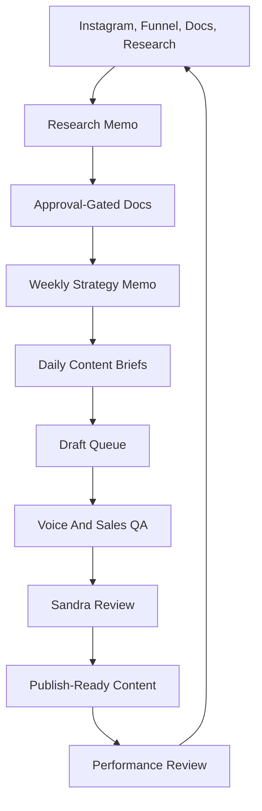

# Social Content Intelligence Agent Architecture

Status: Founder-only implementation spec  
Last updated: 2026-04-27  
Scope: Sandra's private content intelligence workflow. Not user-facing.

## Decision

Do not build this inside Maya, Feed Planner, or Studio.

Start with:

1. Cursor canvas as the live operator board.
2. Approval-gated markdown docs as memory.
3. Composio/read-only research pulls for Instagram and Drive.
4. Human approval before any content becomes canonical or publish-ready.

Move into `/admin` only if the canvas workflow proves valuable enough to justify a maintained private product surface.

## System Boundary

This system may reuse infrastructure ideas from the app, but it must not share Sandra-private context with customer-facing agents.

Allowed:

- founder-only docs in `docs/founder-content/`
- Cursor canvases
- read-only Composio Instagram pulls
- read-only app analytics review
- external research
- manual Sandra labels and approvals

Not allowed without explicit approval:

- importing Sandra-private docs into Maya prompts
- adding this context to Studio user sessions
- auto-posting to Instagram
- exposing drafts to customers
- creating a new North/Stella/Alex operational agent

## Workflow

## Corrected Workflow Diagnosis

The first canvas failed because the system chose topics from historical top-performing selfie posts before checking fresh audience demand and market pattern fit.

The corrected workflow is:

1. Start with current audience demand.
2. Check what historical content has proven.
3. Check what current creator/algorithm strategy rewards.
4. Choose the content lane.
5. Write the hook.
6. Only then draft the post.

If the system jumps from "selfie tutorial performed" to "make the whole week selfie tutorials," it has failed.

## Mandatory Brief Gates

Every content brief must pass:

- **Performance gate:** past saves, shares, comments, watch/reach, opt-ins, or known underperformance.
- **Audience-demand gate:** poll responses, story replies, comments, DMs, applications, email replies, customer feedback.
- **Market-pattern gate:** pattern interrupt, specificity shock, identity mirror, curiosity gap, or DM-share trigger.

Current audience-demand priority:

1. Money / Income
2. Confidence / Mindset
3. Time / Overwhelm
4. Visibility / Getting seen

## Agent Steps

### 1. Researcher

Inputs:

- recent Instagram media and insights
- high-performing and low-performing captions
- comments and safe audience language samples
- funnel analytics and checkout signals
- existing content templates
- current platform research

Output:

- weekly signal memo
- top working patterns
- weak patterns
- fresh audience demand
- competitor/market pattern notes
- content opportunities
- risks and caveats

### 2. Strategist

Inputs:

- research memo
- approved funnel offer map
- approved content playbook
- sprint canvas

Output:

- weekly theme
- offer focus
- audience tension
- content mix
- content lane selection
- scroll-stop trigger selection
- daily brief list

### 3. Story Editor

Inputs:

- Sandra Story Bank
- audience tension
- selected offer
- platform format

Output:

- hook options
- scene options
- story spine
- practical takeaway
- share/save reason

### 4. Voice Editor

Inputs:

- Sandra Content Voice Bible
- forbidden generic patterns
- approved/rejected examples

Output:

- rewritten draft
- voice notes
- what was removed

### 5. QA Gate

Checks:

- sounds like Sandra
- has one concrete scene
- has one useful takeaway
- has one CTA
- does not overpromise income
- matches the funnel stage
- passes the audience-demand gate
- passes the market-pattern gate
- includes reason it should work
- includes reason it might fail

### 6. Performance Analyst

Inputs:

- views
- reach
- saves
- shares
- comments
- DMs/replies where safe
- opt-ins
- checkouts/revenue attribution where available

Output:

- repeat, revise, or retire decision
- updated hook/format notes
- next week's content recommendation

## Data Model For Later Admin Tool

Only build this if the canvas version proves useful.

Potential tables:

- `founder_content_sources`
- `founder_content_signals`
- `founder_content_briefs`
- `founder_content_drafts`
- `founder_content_reviews`
- `founder_content_performance`

Required labels:

- `sounds_like_me`
- `does_not_sound_like_me`
- `too_salesy`
- `too_generic`
- `use_this_structure_again`
- `needs_more_story`
- `needs_more_practical_value`

## Acceptance Tests

- A content brief must cite at least one data signal.
- A content brief must cite one current audience-demand signal.
- A content brief must name its scroll-stop trigger.
- A draft must cite one audience signal, one story angle, one offer, and one format.
- The system must never generate a guaranteed income claim.
- The system must never auto-post.
- The system must clearly mark draft vs approved documents.
- The system must keep founder-only docs separate from customer-facing prompts.
- A weekly plan must not contain only selfie/tutorial content.

## First Implementation Recommendation

Use the canvas workflow for the first two weeks:

1. Run a weekly audit.
2. Create a weekly memo.
3. Generate 3 daily briefs.
4. Draft 1 post.
5. Sandra labels the draft.
6. After posting, record saves, shares, comments, DMs, and opt-ins.
7. Repeat only the structures that performed.

If this saves Sandra time and produces usable content, then build a private `/admin/content-intelligence` tool.
