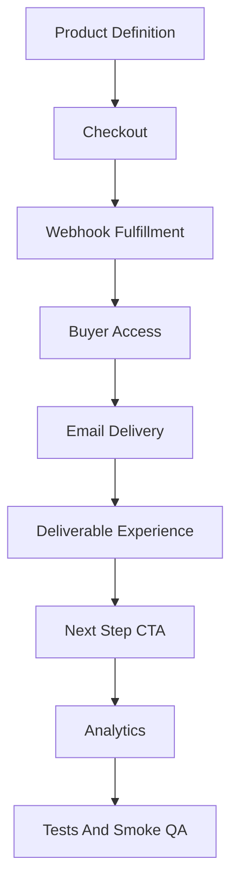

# SSELFIE 2026 E2E Implementation Checklist

Last updated: 2026-04-25

Use this checklist before shipping any funnel, bundle, product, or deliverable change.

## Required Shipping Gate

A change is not done until this chain works:

## 1. Product Definition

- Product ID is correct in `lib/products.ts`.
- Product display name and description match the new promise.
- Price and currency copy match checkout and sales pages.
- Bundle includes are documented.
- Product status is Primary, Support, or Archive Candidate.

## 2. Entitlements And Access

- Bundle aliases are correct in `lib/academy-entitlements.ts`.
- Existing buyers keep access.
- New buyers receive the correct resources.
- Studio membership inclusion is intentional.
- Paid Blueprint access does not conflict with Academy product access.

## 3. Checkout

- Public route creates the intended product.
- Embedded checkout passes the right `productId`.
- `product_type` in checkout success matches fulfillment/reporting.
- Failure/cancel paths still work.
- Annual/monthly paths are tested for Studio.

## 4. Webhook Fulfillment

- Stripe webhook grants the right entitlement.
- Tags are added where needed.
- Credits are granted where promised.
- Setup tokens are created where needed.
- Delivery email is sent once.
- Existing idempotency/deduplication is preserved.

## 5. Success Page

- Buyer sees what they bought.
- Buyer gets one clear next action.
- Any polling/retry copy is understandable.
- The page does not send buyers to a dead end.
- Analytics captures the success state.

## 6. Buyer Home / Access Page

- There is one obvious place to use the deliverable.
- The first action is above the fold.
- Bundled resources are visible without creating clutter.
- Missing/invalid token states are recoverable.
- Logged-in and tokenized access paths agree.

## 7. Email Delivery

- Day-0 email matches the product promise.
- Primary link opens the correct buyer home/access page.
- Nurture sequence matches the same outcome.
- Upsells happen after value.
- UTM/revenue links are correct.

## 8. Deliverable Experience

- The user can complete one useful action quickly.
- Static files are not the whole value.
- AI outputs are framed as implementation assets.
- The deliverable points to the next best step.
- Income-facing content uses safe language.

## 9. Analytics And Admin

- Checkout start is tracked.
- Purchase is visible by product/bundle.
- Deliverable open is tracked.
- First meaningful action is tracked.
- Upsell click is tracked.
- Admin revenue/analytics can explain what was sold and delivered.

## 10. Tests

Add or update tests for:

- product catalog expectations
- bundle entitlement aliases
- checkout route product type
- delivery email links
- revenue attribution links
- buyer access paths
- smoke flow config

## 11. Smoke QA

Before launch, verify:

- landing page loads
- checkout starts
- checkout reaches embedded Stripe or expected hosted flow
- success path points to deliverable
- buyer access path renders
- delivery email link format is correct
- no active public route returns a confusing dead end

## Product-Specific Gates

### Selfie Guide

- Guide, access page, delivery email, and nurture sequence all promise the same first-photo outcome.
- Free and paid paths are clearly different or intentionally unified.

### Starter Kit

- Buyer receives Selfie Guide access.
- Preset/resource links are available.
- 7-day content starter exists before marketing it.

### Brand Strategy Pack

- Setup link works.
- Generation works.
- Output page includes implementation actions.
- Masterclass inclusion is tested if bundled.

### Blueprint

- Buyer can reach Feed Planner or Blueprint home.
- Follow-up emails use current route/query behavior.
- Buyer gets implementation before upsell.

### Masterclass

- Brand Strategy access is included.
- Income module exists before income copy goes live.
- Compliance disclaimer is visible.
- Academy home shows the correct first step.

### Studio

- Monthly and annual checkout work.
- Member sees weekly workflow.
- Included resources are accessible.
- Maya/Studio first action is obvious.

## Release Order

1. Documentation and offer map.
2. Product catalog/entitlement changes.
3. Checkout and webhook changes.
4. Buyer access and success-page changes.
5. Email changes.
6. Analytics and admin visibility.
7. Tests.
8. Smoke QA.
9. Launch.
10. Cleanup/redirect pass.

## Stop Conditions

Stop and fix before shipping if:

- checkout sells one thing and fulfillment grants another
- buyer does not know where to start
- email link points to an old or confusing route
- income copy implies guaranteed earnings
- tests pass but smoke flow fails
- admin revenue data becomes harder to interpret
