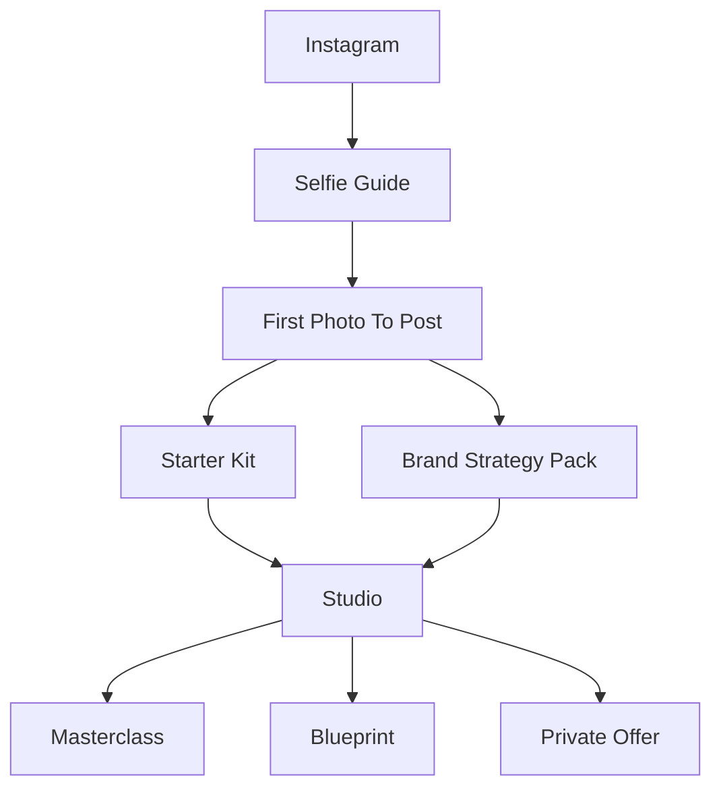

# SSELFIE 2026 Funnel Decision

Last updated: 2026-04-25

## Decision

SSELFIE will be positioned as the 2026 personal brand studio for women who want to turn their phone, selfies, and story into income-ready visibility.

The public promise is:

> Turn your selfies into a personal brand presence you can post, explain, and sell from.

This keeps the proven selfie/visibility entry point, but connects it to what the audience is asking for now: income, confidence, clarity, and less overwhelm.

## Why This Direction

The strongest audience signal from the recent story poll was `Money / Income` at 45%, with `Confidence / Mindset` and `Time / Overwhelm` both at 23%. Direct questions included:

- "How to build if you just start?"
- "How did you manage to make income online?"

Instagram data supports the entry point: selfie tutorials and phone-based brand photo content are the strongest attention drivers. Recent high-performing posts reached hundreds of thousands of views, with strong saves, shares, and comments around "Comment SELFIE" offers.

The conclusion: the audience does not only want a better selfie. They want the selfie to become proof, confidence, consistency, content, and a path toward making money online.

## What We Are Selling

SSELFIE should sell a guided transformation:

1. Take a selfie you feel confident posting.
2. Turn that selfie into personal brand visuals.
3. Understand what to say and what you sell.
4. Publish content that builds trust.
5. Use Maya/SSELFIE to keep creating without overwhelm.

The deliverable is not a generic PDF or Canva template. The deliverable is a result-producing workflow supported by education, AI, prompts, strategy, emails, and guided next steps.

## What We Are Not Selling As The Main Story

Do not lead with:

- generic templates
- passive PDFs
- "AI photo app" as the whole promise
- a confusing menu of many small products
- guaranteed income claims
- "make money online" promises without a clear implementation system

Income language must stay realistic and compliant. A safe promise is:

> By the end, you will have a clear offer, a simple visibility system, a 30-day content plan, and the assets/scripts to start selling online.

## Offer Roles

| Offer | Role | Primary Job |
| --- | --- | --- |
| Selfie Guide | Free or low-ticket trust builder | Help her take one photo she is willing to post. |
| Starter Kit | First paid implementation kit | Help her create a baseline brand look and short content rhythm. |
| Brand Strategy Pack | Personalized clarity layer | Help her know what to say, who she helps, and how to position herself. |
| Masterclass | Structured education | Teach visibility, offer clarity, content-to-cash, and AI-assisted execution. |
| Blueprint | 30-day implementation workflow | Help her turn strategy into a publishable content plan. |
| Studio/Maya | Core recurring product | Become her weekly personal brand studio for visuals, captions, planning, and implementation. |
| Private Offer | Premium support | For buyers who want hands-on guidance after trust is built. |

## Bundle Direction

Bundles should increase perceived value without making the funnel harder to operate.

- Selfie Guide should become stronger through a clearer challenge and first-post outcome.
- Starter Kit should include Selfie Guide plus presets/resources plus a lightweight Blueprint-style content starter.
- Masterclass should include Brand Strategy Pack because income/content training requires positioning first.
- Studio should include access to the key learning assets as member value while remaining the main implementation home.

## North Star Customer Path

## Operating Principle

Every public CTA should move the customer to one of three outcomes:

- create the first visible result
- clarify the offer/message
- keep implementing inside Studio

If a page, product, email, or feature does not support one of those outcomes, it becomes a support or archive candidate.
