# Maya Prompt Builder System - Complete Analysis
*Generated: January 4, 2026*
*Mission: Understand Maya's prompt system before consolidation*

---

## 📊 1. PROMPT BUILDER ANALYSIS

| Builder File | Used in Production? | Called From | Purpose | Contains Fashion Knowledge? |
|--------------|---------------------|-------------|---------|----------------------------|
| `prompt-constructor.ts` | ✅ **YES** | `app/api/maya/generate-concepts/route.ts` (line 25-29) | **Classic Mode**: Builds 250-500 word prompts with brand names, camera specs, lighting. Uses `buildPrompt()` and `buildPromptWithFeatures()`. | ✅ **YES** - Imports `brand-library-2025.ts` (line 12) |
| `prompt-constructor-enhanced.ts` | ✅ **YES** | `app/api/maya/generate-concepts/route.ts` (line 30) | **Pro Mode**: Builds 150-400 word enhanced prompts with dynamic sections. Uses `buildEnhancedPrompt()`. | ✅ **YES** - Imports `brand-library-2025.ts` (line 15) |
| `prompt-constructor-integration.ts` | ⚠️ **PARTIAL** | `lib/maya/prompt-brand-enhancer.ts` (line 9) | **Utility**: Category detection and validation. Wraps `prompt-constructor.ts`. NOT directly called in production routes. | ✅ **YES** - Imports `brand-library-2025.ts` and `prompt-constructor.ts` |
| `flux-prompt-builder.ts` | ❌ **NO** | **NOT FOUND** in production routes | **Deprecated**: Class-based Flux prompt builder. Referenced in docs but NOT imported in any API route. | ✅ **YES** - Imports `fashion-knowledge-2025.ts` (line 1) |
| `nano-banana-prompt-builder.ts` | ✅ **YES** | `app/api/studio-pro/generate/*` (3 routes), `app/api/feed-planner/*` (2 routes), `app/api/feed/[feedId]/regenerate-post/route.ts` | **Studio Pro ONLY**: Builds 50-80 word natural language prompts for Nano Banana Pro. NO trigger words. | ⚠️ **PARTIAL** - Uses `prompt-templates/high-end-brands` for category detection, but doesn't directly import fashion knowledge |
| `classic-prompt-builder.ts` | ❌ **NO** | **NOT FOUND** in production routes | **Unused**: Flux-optimized classic mode builder. NOT imported anywhere. | ❌ **NO** - No fashion knowledge imports |
| `pro-prompt-builder.ts` | ❌ **NO** | **NOT FOUND** in production routes | **Unused**: Nano Banana Pro builder. NOT imported anywhere. | ❌ **NO** - No fashion knowledge imports |
| `guide-prompt-handler.ts` | ✅ **YES** | `app/api/maya/generate-concepts/route.ts` (line 19), `app/api/maya/pro/generate-concepts/route.ts` (line 19) | **Guide Mode**: Handles guide prompts from users. Extracts elements, merges with images, creates variations. | ❌ **NO** - Utility functions only, no fashion knowledge |

---

## 🎯 2. FEATURE USAGE MAP

| Feature | Mode | Prompt Builder Used | Code Path | Evidence |
|---------|------|---------------------|-----------|----------|
| **Maya Chat Photos** | Classic | `buildPrompt()` from `prompt-constructor.ts` | `app/api/maya/generate-concepts/route.ts` (line 629) | Uses `buildPromptWithFeatures()` for Classic mode concepts |
| **Maya Chat Photos** | Pro | `buildEnhancedPrompt()` from `prompt-constructor-enhanced.ts` | `app/api/maya/generate-concepts/route.ts` (line 3096) | Uses `buildEnhancedPrompt()` for Pro mode concepts |
| **Maya Feed Creation** | Pro | `buildNanoBananaPrompt()` from `nano-banana-prompt-builder.ts` | `app/api/feed-planner/create-from-strategy/route.ts` (line 737) | Dynamic import for Pro mode feed posts |
| **Maya Feed Strategy** | Pro | `buildNanoBananaPrompt()` from `nano-banana-prompt-builder.ts` | `app/api/feed-planner/create-strategy/route.ts` (line 1144) | Used for generating feed post prompts |
| **Studio Generation** | Classic | Maya's direct prompt (no builder) | `app/api/maya/generate-image/route.ts` | Uses Maya's generated prompt directly, no builder called |
| **Studio Pro Carousel** | Pro | `buildNanoBananaPrompt()` from `nano-banana-prompt-builder.ts` | `app/api/studio-pro/generate/carousel/route.ts` (line 158) | Studio Pro carousel generation |
| **Studio Pro Reel Cover** | Pro | `buildNanoBananaPrompt()` from `nano-banana-prompt-builder.ts` | `app/api/studio-pro/generate/reel-cover/route.ts` (line 138) | Studio Pro reel cover generation |
| **Studio Pro Edit/Reuse** | Pro | `buildNanoBananaPrompt()` from `nano-banana-prompt-builder.ts` | `app/api/studio-pro/generate/edit-reuse/route.ts` (line 187) | Studio Pro edit/reuse workflow |
| **Feed Post Regeneration** | Pro | `buildNanoBananaPrompt()` from `nano-banana-prompt-builder.ts` | `app/api/feed/[feedId]/regenerate-post/route.ts` (line 106) | Regenerates missing prompts using Nano Banana builder |
| **Guide Prompt Handling** | Both | `guide-prompt-handler.ts` (utility) | `app/api/maya/generate-concepts/route.ts` (line 19) | Extracts elements, merges images, creates variations |

---

## 🧠 3. MAYA'S INTELLIGENCE SOURCES

| Knowledge File | Used By Which Builders | Purpose | Evidence |
|----------------|------------------------|---------|----------|
| `brand-library-2025.ts` | ✅ `prompt-constructor.ts` ✅ `prompt-constructor-enhanced.ts` ✅ `prompt-constructor-integration.ts` ✅ `prompt-brand-enhancer.ts` | **Core Brand Intelligence**: Contains 100+ real brand items (Alo Yoga, Lululemon, Nike, Chanel, Bottega, etc.) with specific product names, colors, details. Functions: `generateCompleteOutfit()`, `getDetailedDescription()`. | Direct imports in all active builders |
| `fashion-knowledge-2025.ts` | ⚠️ `flux-prompt-builder.ts` (deprecated) ❌ Not used by active builders | **Fashion Trends 2025**: Instagram aesthetics (raw_authentic, quiet_luxury, mob_wife, clean_girl, scandi_minimal, urban_luxury). Contains keywords, brands, vibes, poses, lighting. | Only imported by unused `flux-prompt-builder.ts` |
| `authentic-photography-knowledge.ts` | ❌ Not imported by any builder | **Photography Tips**: Authentic photography knowledge | Not found in builder imports |
| `luxury-lifestyle-settings.ts` | ✅ `app/api/maya/generate-concepts/route.ts` (line 10) | **Luxury Settings**: Lifestyle context intelligence. Used in concept generation, NOT in builders. | Imported in route, not in builders |
| `instagram-loras.ts` | ❌ Not imported by any builder | **LoRA Settings**: Instagram LoRA configuration | Not found in builder imports |
| `lifestyle-contexts.ts` | ✅ `app/api/maya/generate-concepts/route.ts` (line 7) | **Lifestyle Context**: Lifestyle intelligence. Used in concept generation, NOT in builders. | Imported in route, not in builders |
| `influencer-posing-knowledge.ts` | ✅ `app/api/maya/generate-concepts/route.ts` (line 8) | **Posing Knowledge**: Influencer posing intelligence. Used in concept generation, NOT in builders. | Imported in route, not in builders |
| `instagram-location-intelligence.ts` | ✅ `app/api/maya/generate-concepts/route.ts` (line 9) | **Location Intelligence**: Instagram location data. Used in concept generation, NOT in builders. | Imported in route, not in builders |
| `prompt-templates/high-end-brands/` | ✅ `nano-banana-prompt-builder.ts` (line 19) | **Brand Templates**: High-end brand templates for category detection. Used by Studio Pro builder. | `detectCategoryAndBrand()` function |

---

## 🔄 4. DEPENDENCY MAPPING

```mermaid
graph TD
    A["/api/maya/chat<br/>(Main Entry)"] --> B{Mode Detection}
    B -->|Classic Mode| C["/api/maya/generate-concepts"]
    B -->|Pro Mode| C
    B -->|Feed Tab| D["/api/maya/feed/*"]
    B -->|Studio Pro| E["/api/maya/generate-studio-pro"]
    
    C --> F{Concept Type}
    F -->|Classic| G["buildPrompt()<br/>prompt-constructor.ts"]
    F -->|Pro| H["buildEnhancedPrompt()<br/>prompt-constructor-enhanced.ts"]
    F -->|Guide Prompt| I["guide-prompt-handler.ts<br/>(utility functions)"]
    
    G --> J["brand-library-2025.ts<br/>✅ CORE INTELLIGENCE"]
    H --> J
    
    D --> K["/api/feed-planner/create-from-strategy"]
    K --> L["buildNanoBananaPrompt()<br/>nano-banana-prompt-builder.ts"]
    L --> M["prompt-templates/high-end-brands/<br/>⚠️ Limited intelligence"]
    
    E --> N["/api/studio-pro/generate/*"]
    N --> L
    
    O["/api/maya/generate-image<br/>(Classic Image Gen)"] --> P["Uses Maya's prompt directly<br/>❌ No builder called"]
    
    Q["/api/feed/[feedId]/regenerate-post"] --> L
    
    style J fill:#90EE90
    style M fill:#FFE4B5
    style P fill:#FFB6C1
```

### Key Findings from Dependency Map:
1. **Classic Mode** → `prompt-constructor.ts` → `brand-library-2025.ts` ✅
2. **Pro Mode** → `prompt-constructor-enhanced.ts` → `brand-library-2025.ts` ✅
3. **Studio Pro** → `nano-banana-prompt-builder.ts` → `high-end-brands/` templates ⚠️
4. **Classic Image Gen** → No builder (uses Maya's prompt directly) ❌
5. **Feed Planner** → `nano-banana-prompt-builder.ts` → Limited intelligence ⚠️

---

## 🎯 5. CRITICAL FINDINGS

### Source of Truth Prompt Builder

**PRIMARY: `prompt-constructor.ts` + `prompt-constructor-enhanced.ts`**

**Reason:**
- ✅ Both are actively imported and called in `app/api/maya/generate-concepts/route.ts`
- ✅ Both import `brand-library-2025.ts` (Maya's core fashion intelligence)
- ✅ `prompt-constructor.ts` is used for Classic Mode (line 629: `buildPromptWithFeatures()`)
- ✅ `prompt-constructor-enhanced.ts` is used for Pro Mode (line 3096: `buildEnhancedPrompt()`)
- ✅ These are the ONLY builders that contain Maya's complete brand intelligence

**SECONDARY: `nano-banana-prompt-builder.ts`**

**Reason:**
- ✅ Used in Studio Pro routes (carousel, reel-cover, edit-reuse)
- ✅ Used in Feed Planner routes (create-from-strategy, create-strategy)
- ⚠️ Uses `prompt-templates/high-end-brands/` for category detection (limited intelligence)
- ⚠️ Does NOT directly import `brand-library-2025.ts` or `fashion-knowledge-2025.ts`

---

### Redundant Builders

| Builder | Status | Why It's Not Used |
|---------|--------|-------------------|
| `flux-prompt-builder.ts` | ❌ **DEPRECATED** | Class-based builder. NOT imported in any production route. Only referenced in documentation. Contains `fashion-knowledge-2025.ts` but unused. |
| `classic-prompt-builder.ts` | ❌ **UNUSED** | Flux-optimized classic builder. NOT imported anywhere. No fashion knowledge. |
| `pro-prompt-builder.ts` | ❌ **UNUSED** | Nano Banana Pro builder. NOT imported anywhere. No fashion knowledge. |
| `prompt-constructor-integration.ts` | ⚠️ **UTILITY ONLY** | Only used by `prompt-brand-enhancer.ts` (which may also be unused). Wraps `prompt-constructor.ts` but not directly called in routes. |

---

### Most Used Features

1. **Maya Chat Concept Generation** (Classic + Pro)
   - **Evidence**: `app/api/maya/generate-concepts/route.ts` - Main concept generation endpoint
   - **Usage**: Both `buildPrompt()` (Classic) and `buildEnhancedPrompt()` (Pro) are called
   - **Frequency**: Every time user requests photoshoot concepts in Maya chat

2. **Studio Pro Workflows** (Carousel, Reel Cover, Edit/Reuse)
   - **Evidence**: 3 Studio Pro routes all use `buildNanoBananaPrompt()`
   - **Usage**: `nano-banana-prompt-builder.ts` for all Studio Pro features
   - **Frequency**: Studio Pro users generating carousels, reel covers, edits

3. **Feed Planner Generation**
   - **Evidence**: `app/api/feed-planner/create-from-strategy/route.ts` and `create-strategy/route.ts`
   - **Usage**: `buildNanoBananaPrompt()` for feed post prompts
   - **Frequency**: Every 9-post feed generation

4. **Classic Image Generation**
   - **Evidence**: `app/api/maya/generate-image/route.ts`
   - **Usage**: **NO BUILDER CALLED** - Uses Maya's prompt directly from chat
   - **Frequency**: Every Classic mode image generation
   - **⚠️ RISK**: No builder means no brand intelligence applied at image generation time

---

### Maya's Intelligence Located In

1. **`brand-library-2025.ts`** - **CRITICAL**
   - **What it contains**: 100+ real brand items with specific product names
   - **Brands**: Alo Yoga, Lululemon, Nike, Adidas, Chanel, Bottega, Cartier, UGG, Levi's, New Balance
   - **Functions**: `generateCompleteOutfit()`, `getDetailedDescription()`
   - **Used by**: `prompt-constructor.ts`, `prompt-constructor-enhanced.ts`
   - **Status**: ✅ **ACTIVE - DO NOT REMOVE**

2. **`fashion-knowledge-2025.ts`** - **DEPRECATED**
   - **What it contains**: Instagram aesthetics (quiet_luxury, mob_wife, clean_girl, etc.)
   - **Used by**: Only `flux-prompt-builder.ts` (which is unused)
   - **Status**: ⚠️ **NOT USED IN PRODUCTION** - Could be valuable if integrated

3. **`prompt-templates/high-end-brands/`** - **LIMITED**
   - **What it contains**: Brand templates for category detection
   - **Used by**: `nano-banana-prompt-builder.ts` (Studio Pro)
   - **Status**: ⚠️ **ACTIVE BUT LIMITED** - Only category detection, not full brand intelligence

4. **Route-Level Intelligence** (NOT in builders)
   - `luxury-lifestyle-settings.ts` - Used in concept generation route
   - `lifestyle-contexts.ts` - Used in concept generation route
   - `influencer-posing-knowledge.ts` - Used in concept generation route
   - `instagram-location-intelligence.ts` - Used in concept generation route
   - **Status**: ✅ **ACTIVE** - These inform Maya's concept generation, not prompt building

---

### Risk Assessment

#### ✅ Safe to Consolidate:
1. **`flux-prompt-builder.ts`** - Not used, can be archived
2. **`classic-prompt-builder.ts`** - Not used, can be deleted
3. **`pro-prompt-builder.ts`** - Not used, can be deleted
4. **`prompt-constructor-integration.ts`** - Only used by potentially unused `prompt-brand-enhancer.ts`, can be merged into main constructor

#### ⚠️ Requires Careful Migration:
1. **`nano-banana-prompt-builder.ts`** - Active in Studio Pro and Feed Planner
   - **Risk**: Currently uses limited intelligence (`high-end-brands/` templates only)
   - **Opportunity**: Could be enhanced to use `brand-library-2025.ts` for better brand intelligence
   - **Action**: Before consolidating, ensure it gets access to full brand library

2. **`prompt-constructor.ts` vs `prompt-constructor-enhanced.ts`**
   - **Risk**: Two separate builders for Classic vs Pro mode
   - **Opportunity**: Could be unified into single builder with mode parameter
   - **Action**: Test thoroughly - both are actively used

#### 🔴 DO NOT TOUCH:
1. **`brand-library-2025.ts`** - **CRITICAL SOURCE OF TRUTH**
   - Contains all brand intelligence
   - Used by both active builders
   - **DO NOT MODIFY** without extensive testing

2. **`guide-prompt-handler.ts`** - **ACTIVE UTILITY**
   - Used in concept generation for guide prompts
   - Utility functions, not a builder
   - **DO NOT REMOVE**

3. **Route-level intelligence files** - **ACTIVE IN CONCEPT GENERATION**
   - `luxury-lifestyle-settings.ts`
   - `lifestyle-contexts.ts`
   - `influencer-posing-knowledge.ts`
   - `instagram-location-intelligence.ts`
   - These inform Maya's AI, not prompt builders
   - **DO NOT REMOVE**

---

## 📋 RECOMMENDATION

### Priority A: Immediate Cleanup (Zero Risk)

**Delete these unused builders:**
1. ❌ `lib/maya/flux-prompt-builder.ts` - Not imported anywhere
2. ❌ `lib/maya/prompt-builders/classic-prompt-builder.ts` - Not imported anywhere
3. ❌ `lib/maya/prompt-builders/pro-prompt-builder.ts` - Not imported anywhere

**Archive these:**
4. ⚠️ `lib/maya/prompt-constructor-integration.ts` - Only used by potentially unused file

**Impact**: Removes 3-4 unused files, reduces confusion. **Zero risk** - they're not called.

---

### Priority B: Enhance Studio Pro Intelligence (Medium Risk)

**Problem**: `nano-banana-prompt-builder.ts` uses limited intelligence (`high-end-brands/` templates) instead of full `brand-library-2025.ts`.

**Solution**: 
1. Import `brand-library-2025.ts` into `nano-banana-prompt-builder.ts`
2. Use `generateCompleteOutfit()` for Studio Pro prompts
3. Test thoroughly with Studio Pro workflows

**Impact**: Studio Pro gets full brand intelligence. **Medium risk** - requires testing all Studio Pro routes.

---

### Priority C: Unify Classic/Pro Builders (High Risk - Future)

**Problem**: Two separate builders (`prompt-constructor.ts` and `prompt-constructor-enhanced.ts`) for Classic vs Pro mode.

**Solution**:
1. Create unified `prompt-builder.ts` with mode parameter
2. Migrate both Classic and Pro to use unified builder
3. Extensive testing required

**Impact**: Single source of truth for prompt building. **High risk** - both builders are actively used in production.

**Recommendation**: **DO NOT DO THIS NOW**. Too risky. Focus on Priority A and B first.

---

## 🎯 FINAL ANSWER

**Which prompt builder is the "source of truth" for production?**

**Answer**: **`prompt-constructor.ts` (Classic) + `prompt-constructor-enhanced.ts` (Pro)**

These are the ONLY builders that:
- ✅ Are actively called in production routes
- ✅ Import `brand-library-2025.ts` (Maya's core intelligence)
- ✅ Handle both Classic and Pro mode concept generation

**Secondary**: `nano-banana-prompt-builder.ts` for Studio Pro, but it needs enhancement to use full brand intelligence.

---

**Which builders are redundant/deprecated?**

**Answer**: 
- ❌ `flux-prompt-builder.ts` - Deprecated, not used
- ❌ `classic-prompt-builder.ts` - Unused
- ❌ `pro-prompt-builder.ts` - Unused
- ⚠️ `prompt-constructor-integration.ts` - Utility only, minimal usage

---

**Which features do users use most?**

**Answer**:
1. **Maya Chat Concept Generation** (Classic + Pro) - Most frequent
2. **Studio Pro Workflows** - Active Studio Pro users
3. **Feed Planner** - 9-post feed generation
4. **Classic Image Generation** - Uses Maya's prompt directly (no builder)

---

**What specific files contain Maya's fashion intelligence?**

**Answer**:
1. ✅ **`brand-library-2025.ts`** - **CRITICAL** - 100+ brand items, used by active builders
2. ⚠️ **`fashion-knowledge-2025.ts`** - Instagram aesthetics, NOT used in production
3. ⚠️ **`prompt-templates/high-end-brands/`** - Limited templates, used by Studio Pro
4. ✅ **Route-level files** - Used in concept generation (not builders)

---

**Is there any risk of losing Maya's uniqueness if we consolidate?**

**Answer**: 

**✅ LOW RISK** if we:
1. Keep `brand-library-2025.ts` untouched
2. Enhance `nano-banana-prompt-builder.ts` to use full brand library
3. Delete only unused builders (Priority A)

**⚠️ MEDIUM RISK** if we:
1. Unify Classic/Pro builders without thorough testing
2. Remove route-level intelligence files

**🔴 HIGH RISK** if we:
1. Modify `brand-library-2025.ts` without testing
2. Remove `guide-prompt-handler.ts`
3. Change how `prompt-constructor.ts` or `prompt-constructor-enhanced.ts` work

---

## ✅ ANALYSIS COMPLETE

**Next Steps:**
1. ✅ Review this analysis
2. ✅ Approve Priority A cleanup (delete 3 unused builders)
3. ✅ Consider Priority B (enhance Studio Pro intelligence)
4. ⚠️ Defer Priority C (unify builders) until later

**Files to Review:**
- `lib/maya/brand-library-2025.ts` - **CRITICAL - DO NOT MODIFY**
- `lib/maya/prompt-constructor.ts` - **ACTIVE - Classic Mode**
- `lib/maya/prompt-constructor-enhanced.ts` - **ACTIVE - Pro Mode**
- `lib/maya/nano-banana-prompt-builder.ts` - **ACTIVE - Studio Pro**

---

*End of Analysis*

